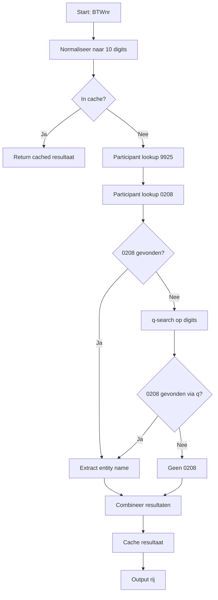

# Peppol lookup

Python script om Peppol participant IDs (0208 / 9925) en de bijhorende entity name op te halen uit de officiële Peppol Directory voor Belgische btw-nummers.

---

## Gebruiksscenario’s

- Verrijken van klantendatabase met Peppol IDs
- Controle of klanten Peppol-ready zijn
- Voorbereiding e-invoicing onboarding

---

## Performance

- ±8 requests/sec (afhankelijk van rate limiting)
- 1000 records ≈ 2–3 minuten

---

## Functionaliteit

Dit script voert een **published-only lookup** uit op de Peppol Directory:

- Haalt Peppol IDs alleen op als ze effectief gepubliceerd zijn
- Ondersteunde schema’s:
  - `0208` (CBE/KBO)
  - `9925` (Belgian VAT)
- Lookup-strategie:
  1. Exacte participant match (primair)
  2. Fallback naar algemene search (`q`) voor 0208 indien nodig
- Entity name wordt best-effort opgehaald uit de directory response
- BTW-nummers worden genormaliseerd naar exact **10 cijfers**
- Resultaten worden **in-memory gecachet** (sneller bij duplicaten)
- HTTP-calls bevatten retry-logica (bij o.a. 429 / 5xx)
- Progress logging en foutmeldingen via console

## Flow



---

## Troubleshooting

- Geen resultaat? → BTWnr fout / niet gepubliceerd
- Veel misses? → check normalisatie
- Rate limit? → verhoog sleep

---

## Vereisten

- Python 3.10+
- Afhankelijkheden (zie `requirements.txt`):
  - pandas
  - openpyxl
  - requests
  - urllib3

Installatie:

```powershell
python -m venv .venv
.\.venv\Scripts\Activate.ps1
pip install -r requirements.txt
```

---

## Gebruik

```powershell
python peppol_lookup.py input.xlsx output.xlsx
python peppol_lookup.py input.xlsx output.xlsx Blad1
```

### Argumenten

| Argument        | Verplicht | Omschrijving |
|-----------------|----------|-------------|
| input.xlsx      | ja       | Inputbestand |
| output.xlsx     | ja       | Outputbestand |
| sheetnaam       | nee      | Naam van de sheet (default: `Blad1`) |

---

## Inputbestand

Excelbestand met minimaal volgende kolommen:

- Kltnr
- Naam
- BTWnr

Andere kolommen (zoals Adres, PC, Plaats, Telefoon, Email) mogen aanwezig zijn maar worden **genegeerd**.

### Belangrijk

- `BTWnr` wordt automatisch opgeschoond:
  - Niet-numerieke tekens worden verwijderd
  - 9 cijfers → wordt gepadded naar 10 cijfers
  - >10 cijfers → laatste 10 worden gebruikt

---

## Outputbestand

Excelbestand met volgende kolommen:

- Kltnr
- Naam
- BTWnr
- Peppol ID 0208
- Peppol ID 9925
- Entity name

Lege waarden worden geschreven als lege string.

---

## Lookup details

### Participant lookup

Er wordt geprobeerd met:

- `iso6523-actorid-upis::9925:be##########`
- `iso6523-actorid-upis::9925:##########`
- `iso6523-actorid-upis::0208:##########`

### Fallback (alleen voor 0208)

Indien 0208 niet gevonden wordt:
- Query via `q=<btwnr>`
- Resultaten worden gescand op exacte match

---

## Entity name extractie

- Eerst gezocht in de matchende participant entry
- Daarna fallback naar volledige payload
- Heuristieken filteren technische waarden (IDs, URLs, etc.)

---

## Logging & gedrag

- Elke 50 records wordt voortgang gelogd
- Onvindbare BTW-nummers worden gemeld in console
- HTTP errors worden opgevangen en opnieuw geprobeerd
- Optioneel debug-mode (in code) om payloads weg te schrijven

---

## Beperkingen

- Enkel Belgische BTW-nummers ondersteund
- Afhankelijk van Peppol Directory beschikbaarheid
- Geen persistente cache (alleen runtime)

---

## Voorbeeld

Input:

| Kltnr | Naam        | BTWnr        |
|------|-------------|--------------|
| 1    | Bedrijf A   | BE0473191833 |

Output:

| Kltnr | Naam      | BTWnr        | Peppol ID 0208 | Peppol ID 9925 | Entity name |
|------|-----------|--------------|----------------|----------------|-------------|
| 1    | Bedrijf A | BE0473191833 | 0208:0473191833 | 9925:BE0473191833 | Bedrijf A NV |

---

## Licentie

Dit project valt onder de MIT-licentie.